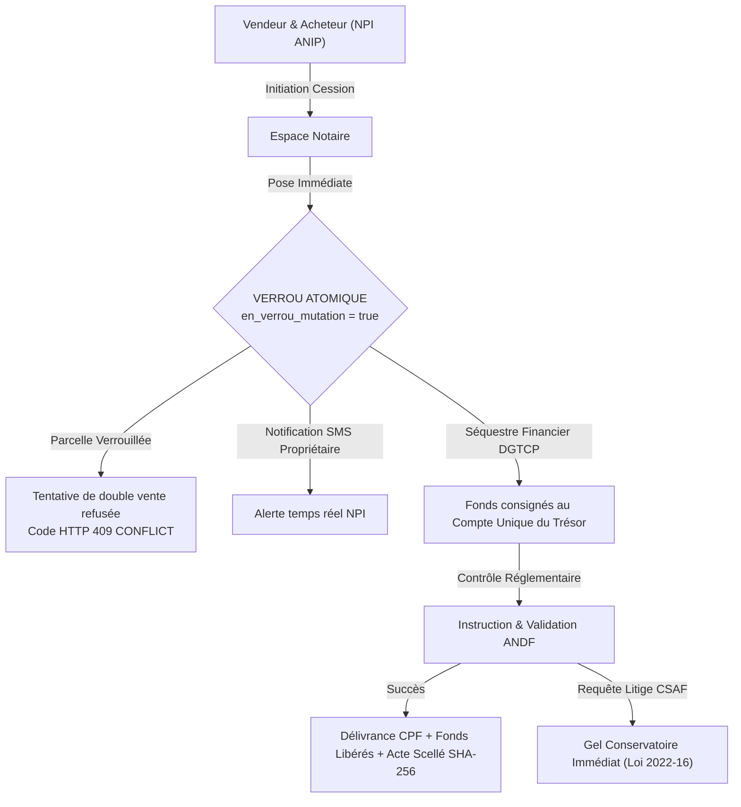

# ANYIGBA (BENINLAND)
### Plateforme Nationale Souveraine de Gestion et de Sécurisation du Foncier en République du Bénin

<p align="center">
  
</p>

<p align="center">
  <strong>République du Bénin</strong><br>
  <em>Fraternité — Justice — Travail</em><br>
  <strong>Agence Nationale du Domaine et du Foncier (ANDF)</strong> &bull; <strong>Ministère du Cadre de Vie et des Transports</strong><br>
  <strong>Cour Spéciale des Affaires Foncières (CSAF)</strong> &bull; <strong>Direction Générale du Trésor et de la Comptabilité Publique (DGTCP)</strong>
</p>

<p align="center">
  <a href="https://nextjs.org"></a>
  <a href="https://react.dev"></a>
  <a href="https://www.typescriptlang.org"></a>
  <a href="https://tailwindcss.com"></a>
  <a href="https://orm.drizzle.team"></a>
  <a href="https://www.postgresql.org"></a>
  <a href="https://vitest.dev"></a>
  <a href="https://www.electronjs.org"></a>
  <a href="https://www.docker.com"></a>
</p>

---

## Sommaire

1. [Vision, Enjeux Nationaux & Mission d'Anyigba](#1-vision-enjeux-nationaux--mission-danyigba)
2. [Cadre Légal & Principes Fondamentaux de Sécurité Foncière](#2-cadre-légal--principes-fondamentaux-de-sécurité-foncière)
3. [Les 8 Piliers Métiers & Fonctionnalités Opérationnelles](#3-les-8-piliers-métiers--fonctionnalités-opérationnelles)
4. [Matrice des Rôles & Espaces Applicatifs Dédiés](#4-matrice-des-rôles--espaces-applicatifs-dédiés)
5. [Découpage Territorial : 12 Départements & 6 Pôles](#5-découpage-territorial--12-départements--6-pôles)
6. [Architecture Technique, Données & Cryptographie](#6-architecture-technique-données--cryptographie)
7. [Arborescence du Projet](#7-arborescence-du-projet)
8. [Prérequis Système & Installation](#8-prérequis-système--installation)
9. [Scripts Disponibles](#9-scripts-disponibles)
10. [Application Desktop Souveraine (Electron)](#10-application-desktop-souveraine-electron)
11. [Assurance Qualité : Les 148 Tests Vitest](#11-assurance-qualité--les-148-tests-vitest)
12. [Déploiement & Conteneurisation](#12-déploiement--conteneurisation)
13. [Conformité Réglementaire & Protection des Données](#13-conformité-réglementaire--protection-des-données)
14. [Documentation Complémentaire & Références](#14-documentation-complémentaire--références)

---

## 1. Vision, Enjeux Nationaux & Mission d'Anyigba

Au Bénin, la terre (**« Anyigba »** en langue Fongbe) est à la fois l'héritage sacré des ancêtres, le garant de la cohésion sociale et le premier levier de création de richesse économique.

Pendant des décennies, l'écosystème foncier traditionnel a souffert de failles structurelles majeures :
- **La double ou triple vente** d'une même parcelle par un vendeur indélicat ou des cohéritiers concurrents.
- **La prolifération des conventions manuscrites sous seing privé**, signées sur papier libre sans coordonnées géoréférencées fiables, sans bornes cadastrales inaltérables ni vérification d'identité souveraine.
- **L'engorgement massif des tribunaux de première instance**, ayant conduit le Gouvernement de la République à instituer la **Cour Spéciale des Affaires Foncières (CSAF)** par la Loi n° 2022-16.
- **L'exclusion numérique des populations rurales et des aînés**, ne maîtrisant ni le français écrit ni les interfaces numériques complexes.

### La Mission d'Anyigba (BENINLAND)
Anyigba unifie l'ensemble des acteurs de la chaîne domaniale (Citoyens, Notaires, Agents Fonciers de village, Géomètres, ANDF, Mairies, Banques, Trésor Public, Magistrats CSAF) au sein d'une infrastructure numérique d'autorité :
- **Visible** : Cartographie cadastrale interactive haute précision PostGIS / OpenStreetMap couvrant les 77 communes et les 12 départements.
- **Vérifiable en 30 secondes** : Par le web, par QR Code souverain, par SMS (numéro court `132`), par USSD feature phone (`*123*7#`) ou par synthèse vocale en langues nationales (**Fongbe, Yoruba, Hausa, Français**).
- **Infalsifiable & Inviolable** : Verrouillage transactionnel atomique anti-double-vente (HTTP 409 Conflict), séquestre public via la DGTCP, coffre-fort d'actes scellés par SHA-256 et ancrage sur registre immuable (**BéninChain** et **OpenTimestamps**).

> **Règle d'Or du Système : « La Démo et le Registre Souverain ne doivent jamais faillir. »**  
> Tous les parcours critiques fonctionnent de bout en bout de façon déterministe. Les services tiers (télécoms, Mobile Money, TrésorPay, blockchain) sont orchestrés avec une persistance effective en base de données, complétée par un mode mémoire haute disponibilité et la possibilité d'une réinitialisation atomique en un clic vers un état de référence parfait.

---

## 2. Cadre Légal & Principes Fondamentaux de Sécurité Foncière



### Le Crédo Architectural
> *« On ne met pas la terre sur la blockchain, on y met la preuve. Et on rend la double vente mathématiquement et logiquement impossible dans le registre public. »*

1. **Le registre souverain légal** réside dans la base relationnelle géospatiale **PostgreSQL 16 + PostGIS 3.4**, orchestrée par **Drizzle ORM**.
2. **Le verrouillage transactionnel atomique** garantit qu'aucune seconde convention ou intention de mutation ne peut être reçue pendant qu'un dossier est instruit.
3. **Le séquestre financier étatique (DGTCP)** protège l'acheteur contre la dissipation des fonds avant la délivrance du titre définitif.
4. **La couche d'intégrité cryptographique** conserve les condensés numériques SHA-256 salés (`HASH_PEPPER`) et les preuves OpenTimestamps.
5. **La conformité textuelle** applique rigoureusement la **Loi n° 2013-01 / 2017-15** (Code Foncier), la **Loi n° 2022-16** (CSAF) et la **Loi n° 2017-08** (NPI ANIP).

---

## 3. Les 8 Piliers Métiers & Fonctionnalités Opérationnelles

### 1. Moteur de Recherche & Vérification Publique Multi-Canal (`/verification`)
- **Recherche Instantanée** : Saisie du code cadastral unique (ex: `OUI-0421`, `CAL-1002`, `COT-0012`).
- **Restitution Certifiée** : Statut juridique clair (Titre Foncier, CPF, Coutumier Déclaré, Litige CSAF, Cession Verrouillée).
- **Conformité APDP** : Masquage automatique des données à caractère personnel du propriétaire (`M. Sossou A*** M***`).
- **QR Code Souverain** : Scannable directement sur les attestations d'affichage et certificats physiques.
- **Synthèse Vocale Multilingue (API TTS 229)** : Restitution audio en **Fongbe, Yoruba, Hausa et Français**.
- **Canaux Feature Phone** : SMS au numéro court `132` et menu interactif USSD `*123*7#`.

### 2. Cartographie Cadastrale Interactive PostGIS (`/carte`)
- Visualisation vectorielle interactive Leaflet / OpenStreetMap.
- Couverture intégrale des **12 départements** et des **6 Pôles Territoriaux**.
- Filtres avancés : par commune, pôle territorial, statut juridique, superficie, usage.
- Radar télémétrique et inspecteur cadastral : bornes WGS84, contrôle topologique zéro empiètement.

### 3. Verrou Anti-Double-Vente & Mutations Notariées (`/espace/notaire`)
- Verrouillage instantané de la parcelle dès l'ouverture du dossier par le notaire.
- Rejet immédiat de toute tentative concurrente avec code HTTP `409 CONFLICT`.
- Intégration du séquestre financier avec consignation Trésor Public (DGTCP) et Mobile Money (MTN / Moov).
- Déduction automatisée de la taxe communale de plus-value (5%) lors du déblocage final.

### 4. Cadastre Communal & Certificats d'Évaluation TrésorPay (`/espace/commune`)
- Instruction municipale et fixation du prix homologué au mètre carré (Art. 142 Code Foncier).
- Émission de certificats d'évaluation avec QR-Code et quittance TrésorPay DGTCP.
- Décodage automatique côté client et serveur des certificats PDF scellés.

### 5. Validation Souveraine & Délivrance du Titre CPF (`/espace/andf`)
- Instruction technique et vérification cadastrale centrale par l'ANDF.
- Délivrance du **Certificat de Propriété Foncière (CPF)** conférant pleine opposabilité aux tiers.
- Notification SMS automatique au propriétaire lors de la confirmation des droits.

### 6. Chambre Spéciale des Affaires Foncières (`/espace/csaf`)
- Enregistrement des requêtes et contentieux domaniaux (Loi n° 2022-16).
- **Gel Conservatoire Automatique** : Blocage immédiat de toute mutation, division ou hypothèque sur la parcelle litigieuse.
- Suivi des audiences, ordonnances de conciliation et arrêts de la Cour.

### 7. Établissements de Crédit & Hypothèques Prudentielles LTV 70% (`/espace/banque`)
- Vérification de la solvabilité foncière et de la pureté du titre en temps réel.
- **Application du ratio prudentiel LTV plafonné à 70%** de la valeur communale homologuée.
- Inscription et mainlevée électronique des sûretés hypothécaires.

### 8. Convention de Vente Assistée au Village (`/espace/agent`)
- Saisie de terrain par l'Agent Foncier assermenté.
- Bornage GPS avec contrôle de non-chevauchement PostGIS.
- Recueil audio des témoignages des 4 voisins riverains et du Chef de Village.

---

## 4. Matrice des Rôles & Espaces Applicatifs Dédiés

| Rôle Métier | Identifiant Démo | Accès Espace | Missions Principales |
|---|---|---|---|
| **Notaire Instrumentaire** | `notaire@demo.bj` | `/espace/notaire` | Pose de verrou anti-double-vente, actes authentiques, séquestre DGTCP |
| **ANDF (Direction Générale)** | `andf@demo.bj` | `/espace/andf` | Instruction souveraine, validation définitive, émission des TF et CPF |
| **Agent Foncier de Village** | `agent@demo.bj` | `/espace/agent` | Conventions assistées, bornage GPS, recueil audio des témoins riverains |
| **Magistrat CSAF** | `csaf@demo.bj` | `/espace/csaf` | Contentieux foncier (Loi 2022-16), gel conservatoire immédiat |
| **Commune / Mairie** | `commune@demo.bj` | `/espace/commune` | Certificats d'évaluation, quittances TrésorPay, taxe sur plus-value |
| **Citoyen / Propriétaire** | `citoyen@demo.bj` | `/espace/citoyen` | Suivi de patrimoine, carnet de famille foncier, alertes SMS NPI |
| **Banque / Établissement de Crédit** | `banque@demo.bj` | `/espace/banque` | Vérification de garantie, contrôle ratio LTV 70%, hypothèques |
| **Contrôleur Foncier Cadastral** | `controleur@demo.bj` | `/espace/controleur` | Inspection topologique, audit de bornage, conformité SIG |
| **Ministère du Cadre de Vie** | `ministere@demo.bj` | `/espace/ministere` | Observatoire national, thermomètre des prix au m², statistiques macro |
| **Administrateur Système** | `admin@demo.bj` | `/admin` | Santé des nœuds, audit logs, réinitialisation déterministe |

---

## 5. Découpage Territorial : 12 Départements & 6 Pôles

La plateforme intègre le référentiel géographique officiel de la République du Bénin :

- **Les 12 Départements** : Alibori, Atacora, Atlantique, Borgou, Collines, Couffo, Donga, Littoral, Mono, Ouémé, Plateau, Zou.
- **Les 6 Pôles Territoriaux de Développement** :
  1. *Grand-Nokoué* (Cotonou, Abomey-Calavi, Ouidah, Sèmè-Kpodji, Porto-Novo)
  2. *Sud-Ouest* (Mono-Couffo et plateau de l'Atlantique intérieur)
  3. *Sud-Est / Plateau* (Ouémé périurbain et département du Plateau)
  4. *Zou-Collines* (Plateau central, Abomey, Bohicon, Dassa, Savalou)
  5. *Atacora-Donga* (Nord-Ouest, Natitingou, Djougou, Tanguiéta)
  6. *Alibori-Borgou* (Grand Nord, Parakou, Kandi, Malanville, Bembèrèkè)

---

## 6. Architecture Technique, Données & Cryptographie

```
+-----------------------------------------------------------------------------------+
|                            APPLICATION FRONTEND & DESKTOP                         |
|  Next.js 15.5 (App Router) • React 19 • Tailwind CSS v4 • Lucide Icons            |
|  Leaflet (SIG / PostGIS) • QR Code SVG • Electron v44 (Linux AppImage & Win EXE)  |
+-----------------------------------------------------------------------------------+
                                         |
                                         v
+-----------------------------------------------------------------------------------+
|                             COUCHE LOGIQUE & API REST                             |
|  Next.js Route Handlers (/api/v1) • Validation Zod • Authentification NPI / ANIP  |
|  Moteur Anti-Double-Vente • Séquestre DGTCP • Synthèse Vocale TTS 229            |
+-----------------------------------------------------------------------------------+
                                         |
                                         v
+-----------------------------------------------------------------------------------+
|                        COUCHE DE DONNÉES & CRYPTOGRAPHIE                          |
|  Drizzle ORM 0.40 • PostgreSQL 16 + PostGIS 3.4 (Cloud Neon / Docker Local)       |
|  Hachage SHA-256 + PEPPER Souverain • Ancrage OpenTimestamps / BéninChain         |
+-----------------------------------------------------------------------------------+
```

- **Frontend** : Next.js 15 (App Router), React 19, TypeScript strict 5.8, Tailwind CSS v4 (largeur aérée `max-w-[1536px]`, 12 colonnes, paddings sm: et lg:), icônes Lucide.
- **Backend / API** : Route Handlers (`src/app/api/v1/*`), validation stricte Zod, persistance hybride PostgreSQL / Mémoire sécurisée.
- **Base de Données & SIG** : PostgreSQL 16 avec extension PostGIS 3.4, schémas typés avec Drizzle ORM.
- **Client Desktop** : Electron 44.4.5, packaging Linux (.AppImage) et Windows (.exe).

---

## 7. Arborescence du Projet

```text
BENINLAND/
├── .env.example                     # Modèle officiel des variables d'environnement
├── .env.local                       # Configuration locale de développement
├── docker-compose.yml               # Déploiement multi-conteneurs local (App + PostgreSQL)
├── drizzle.config.ts                # Configuration Drizzle ORM & Drizzle Kit
├── electron-builder.json            # Configuration du packaging desktop (Linux & Windows)
├── next.config.js                   # Configuration Next.js
├── package.json                     # Dépendances et scripts de build
├── tsconfig.json                    # Configuration TypeScript strict
├── vitest.config.ts                 # Configuration de la suite de tests Vitest
├── desktop/                         # Binaires exécutables packagés (AppImage, EXE, ZIP)
├── docs/
│   ├── PRESENTATION_BENINLAND.md    # Dossier magistral de présentation institutionnelle
│   ├── CDC_SOURCE_DE_VERITE.md      # Cahier des charges exhaustif et règles d'or
│   ├── ROADMAP_IMPLEMENTATION.md    # Feuille de route et jalons de livraison
│   ├── presentation-anyigba.html    # Support interactif de présentation
│   └── ANYIGBA_DOSSIER_DE_PRESENTATION.pdf # Dossier exécutif officiel imprimable
├── tests/                           # 15 suites de tests automatisés (148 tests réussis)
│   ├── adversarial-pentest-qa.test.ts        # Tests de pénétration et résistance aux injections
│   ├── api-auth-database.test.ts             # Authentification par NPI ANIP et mot de passe
│   ├── api-auxiliary.test.ts                 # Tests des routes SMS, TTS audio et passerelles
│   ├── api-banque-hypotheques.test.ts        # Module bancaire, vérification garantie, ratio LTV 70%
│   ├── api-commune-certificats.test.ts       # Certificats municipaux, extraction PDF et TrésorPay
│   ├── api-csaf-gel.test.ts                  # Procédure de saisine CSAF et gel conservatoire
│   ├── api-demo-reset.test.ts                # Test de réinitialisation déterministe
│   ├── api-mutations.test.ts                 # Test du verrou anti-double-vente et séquestre
│   ├── api-verification.test.ts              # Test du moteur de vérification publique
│   ├── beninvie-portal-and-components.test.ts# Validation de l'UI républicaine
│   ├── core-logic.test.ts                    # Logique métier pure et calcul de plus-value
│   ├── frontend-unified.test.ts              # Rendu des composants et pages
│   ├── leaflet-and-gis.test.ts               # Contrôles géographiques et topologiques PostGIS
│   ├── security-crypto-audio.test.ts         # Intégrité SHA-256, sel cryptographique et audio
│   └── system-hardening-adversarial.test.ts  # Durcissement contre fraudes IDOR et usurpations
└── src/
    ├── app/                         # Pages et Routes App Router Next.js
    ├── components/                  # Composants React modulaires (UI, Carte, Layout)
    ├── db/                          # Schémas Drizzle, migrations et seed souverain
    ├── lib/                         # Utilitaires (géodésie, hash, audio, auth)
    └── repositories/                # Abstraction et accès aux données persistées
```

---

## 8. Prérequis Système & Installation

### Prérequis
- **Node.js** `>= 20.x` (recommandé : Node 22 LTS)
- **pnpm** `>= 9.x`
- **PostgreSQL** `>= 16.x` avec extension **PostGIS 3.4** (ou conteneur Docker)

### Installation Pas-à-Pas

```bash
# 1. Cloner le dépôt
git clone git@github.com:SAGBO4/BENINLAND.git
cd BENINLAND

# 2. Installer les dépendances
pnpm install

# 3. Configurer les variables d'environnement
cp .env.example .env.local

# 4. Lancer la base PostgreSQL (via Docker Compose)
docker compose up -d db

# 5. Initialiser les tables et injecter le jeu de données souverain
pnpm db:seed

# 6. Démarrer le serveur de développement
pnpm dev
```

L'application est immédiatement accessible à l'adresse : **[http://localhost:3000](http://localhost:3000)**.

---

## 9. Scripts Disponibles

| Commande | Action & Rôle |
|---|---|
| `pnpm dev` | Démarre l'application Next.js en mode développement sur le port `3000` |
| `pnpm build` | Compile l'application pour la production avec optimisations Next.js |
| `pnpm start` | Lance le serveur de production compilé |
| `pnpm test` | Exécute les 15 suites de tests avec **Vitest** (148 tests réussis) |
| `pnpm typecheck` | Vérifie la conformité de l'ensemble du code TypeScript strict |
| `pnpm desktop` | Lance l'application Desktop Electron en environnement autonome |
| `pnpm desktop:package` | Génère les binaires Desktop pour Linux (.AppImage) et Windows (.exe) |
| `pnpm db:seed` | Peuple la base de données avec le jeu de données souverain officiel 2026 |
| `pnpm db:reset` | Remet à zéro la base de données et ré-exécute le seed déterministe |

---

## 10. Application Desktop Souveraine (Electron)

Pour les préfectures, tribunaux ou postes de travail municipaux à connectivité restreinte :
- **Détection Automatique de Connectivité** : Bascule transparente entre l'instance locale (`localhost:3000`) et le serveur cloud souverain officiel.
- **Raccourcis Clavier Métiers** : `Ctrl+N` (nouvelle vérification de parcelle), `Ctrl+M` (carte cadastrale plein écran).
- **Impression Directe** : Sortie imprimante officielle des attestations certifiées via le spooler système.

---

## 11. Assurance Qualité : Les 148 Tests Vitest

Le projet applique une rigueur industrielle totale avec **148 tests automatisés** réussis à 100% sur 15 suites :

```text
 ✓ tests/api-commune-certificats.test.ts (15 tests)
 ✓ tests/leaflet-and-gis.test.ts (16 tests)
 ✓ tests/api-banque-hypotheques.test.ts (14 tests)
 ✓ tests/system-hardening-adversarial.test.ts (16 tests)
 ✓ tests/api-auxiliary.test.ts (16 tests)
 ✓ tests/security-crypto-audio.test.ts (11 tests)
 ✓ tests/beninvie-portal-and-components.test.ts (11 tests)
 ✓ tests/adversarial-pentest-qa.test.ts (10 tests)
 ✓ tests/api-mutations.test.ts (8 tests)
 ✓ tests/frontend-unified.test.ts (8 tests)
 ✓ tests/core-logic.test.ts (7 tests)
 ✓ tests/api-auth-database.test.ts (6 tests)
 ✓ tests/api-csaf-gel.test.ts (5 tests)
 ✓ tests/api-verification.test.ts (5 tests)
 ✓ tests/api-demo-reset.test.ts (1 test)

 Test Files  15 passed (15)
      Tests  148 passed (148)
```

Pour exécuter la suite de tests :
```bash
pnpm test
```

---

## 12. Déploiement & Conteneurisation

### Déploiement Docker Compose
```bash
docker compose up -d --build
```
L'application et son instance PostGIS démarrent en environnement autonome sur le port `3000`.

### Déploiement Vercel & Neon Cloud
Le projet est configuré pour un déploiement continu sur **Vercel** couplé à une base **Neon Serverless Postgres**.

---

## 13. Conformité Réglementaire & Protection des Données

- **Loi n° 2013-01 / 2017-15** : Primauté du Titre Foncier inattaquable et opposable aux tiers.
- **Loi n° 2022-16** : Compétence exclusive de la CSAF et gel conservatoire immédiat dès la saisine.
- **Loi n° 2017-08** : Authentification universelle par le NPI délivré par l'ANIP.
- **Autorité de Protection des Données Personnelles (APDP)** : Masquage systématique des données nominatives sur les interfaces publiques.

---

## 14. Documentation Complémentaire & Références

- **[Dossier de Présentation Magistrale (docs/PRESENTATION_BENINLAND.md)](docs/PRESENTATION_BENINLAND.md)**
- **[Cahier des Charges & Source de Vérité (docs/CDC_SOURCE_DE_VERITE.md)](docs/CDC_SOURCE_DE_VERITE.md)**
- **[Feuille de Route d'Implémentation (docs/ROADMAP_IMPLEMENTATION.md)](docs/ROADMAP_IMPLEMENTATION.md)**
- **[Présentation Multimédia Interactive (docs/presentation-anyigba.html)](docs/presentation-anyigba.html)**
- **[Dossier Exécutif Imprimable PDF (docs/ANYIGBA_DOSSIER_DE_PRESENTATION.pdf)](docs/ANYIGBA_DOSSIER_DE_PRESENTATION.pdf)**

---

<p align="center">
  <em>ANYIGBA (BENINLAND) — « La Terre Sécurisée, la Nation Prospère. »</em><br>
  <strong>République du Bénin &bull; 2026</strong>
</p>
