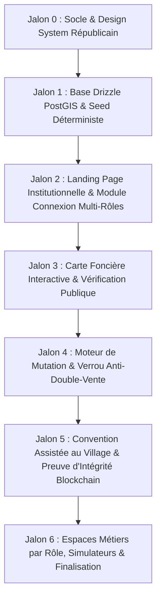

# 🗺️ Feuille de Route d'Implémentation & Jalons — ANYIGBA (BENINLAND)
> **Projet** : Anyigba — Plateforme Nationale de Gestion et de Sécurisation du Foncier au Bénin  
> **Dépôt Git** : `git@github.com:SAGBO4/BENINLAND.git`  
> **Statut** : Document de Cadrage Opérationnel à valider avant lancement des agents  
> **Version** : 1.0.0  
> **Date** : 26 Septembre 2026  

---

## 1. Vue d'Ensemble & Stratégie d'Exécution

Pour répondre aux exigences très élevées d'interface utilisateur, de robustesse technique et de fidélité au scénario de démo républicain (« La démo ne doit jamais planter »), le développement d'Anyigba est structuré en **7 jalons progressifs**.

Chaque jalon est autonome, testable et validé avant d'aborder le suivant.

---

## 2. Découpage Détaillé des Jalons

### 🏛️ Jalon 0 : Socle Applicatif, Design Tokens & Tooling
*Objectif : Installer et configurer l'ensemble des dépendances, des scripts et de la charte visuelle béninoise sans aucune dette technique.*

- [ ] Initialisation de `package.json` avec **Next.js 16 (App Router)**, **React 19**, **TypeScript strict**, **Tailwind CSS v4**, **shadcn/ui**, **Lucide-react**, **Leaflet**, **Drizzle ORM**, **Zod**, **Vitest**.
- [ ] Mise en place du fichier de style global (`src/app/globals.css`) avec les design tokens de la République du Bénin :
  - Vert Forêt Foncier : `#0A5C36` / `#15803D`
  - Or Solaire Royal : `#F2B822` / `#D97706`
  - Terre Cuite Alerte : `#C73E1D` / `#DC2626`
  - Ardoise Institutionnelle : `#0F172A` / `#1E293B`
- [ ] Configuration de `tsconfig.json`, `next.config.js` (mode standalone pour conteneurisation Docker), `drizzle.config.ts` et `vitest.config.ts`.
- [ ] Création du `Dockerfile` multi-étapes et du `docker-compose.yml` avec service PostgreSQL 16 + PostGIS.

### 🗄️ Jalon 1 : Schémas Drizzle, Migrations SQL & Seed Déterministe
*Objectif : Déployer le modèle de données relationnel et spatial, et injecter les parcelles et personas du scénario de référence.*

- [ ] Création des schémas Drizzle dans `db/schema/` :
  - `parcelles` (code unique, coordonnées polygones GeoJSON, surface, statut juridique, verrou, litige).
  - `detenteurs` (NPI, nom complet, téléphone, langue préférée).
  - `droits` (type de droit, quote-part, indivisions, dates).
  - `mutations` (vendeur, acheteur, notaire, prix, statut, preuve SHA-256).
  - `conventions_assistees` (agent NPI, photos des bornes, enregistrements vocaux, statut séquestre MoMo).
  - `coffre_fort_actes` (type d'acte, empreinte SHA-256, sel, référence blockchain).
  - `litiges` (juridiction CSAF, motif, gel conservatoire, ordonnance).
  - `batis` (superficie construite, usage, calcul plus-value).
- [ ] Création du script de seed déterministe (`db/seed/index.ts`) basé sur `faker.seed(2026)` :
  - Injection des communes réelles : **Ouidah** (Pahou, Djègbadji), **Abomey-Calavi** (Togoudo, Akassato), **Allada**, **Cotonou**.
  - Injection de la parcelle fil conducteur `OUI-0421` de la Famille Dossou.
  - Données d'exemples de parcelles aux statuts variés (Titre Foncier 🟢, CPF 🔵, Coutumier 🟡, En Litige 🔴, Mutation en cours 🔒).
- [ ] Configuration de l'accès base hybride (client Neon serverless pour Vercel / client `pg` pour local Docker).

### 🌟 Jalon 2 : Landing Page d'Excellence & Module de Connexion Multi-Rôles à Droite
*Objectif : Répondre précisément à l'exigence UI élevée de l'utilisateur avec une vitrine nationale solennelle et un panneau de connexion asymétrique.*

- [ ] **Section Gauche (Vitrine & Autorité Nationale)** :
  - Header républicain avec logo vectoriel d'Anyigba et devise nationale.
  - Titre accrocheur et présentation de la mission souveraine (éradication de la double vente et transparence foncière).
  - Moteur de recherche express de parcelle : champ de saisie du code cadastral (ex: `OUI-0421`) avec vérification instantanée.
  - Barre de statistiques nationales (KPIs) : Total parcelles immatriculées, tentatives de fraude bloquées, conventions villageoises scellées.
  - Badge de certification ANDF & Ancrage BéninChain.
- [ ] **Section Droite (Module de Connexion Multi-Rôles Interactif)** :
  - Carte surélevée avec effet glassmorphism discret et bordure dorée.
  - Sélecteur de rôle instantané permettant de tester immédiatement la démo avec les 8 profils types :
    1. 🏛️ **Notaire** (`notaire@demo.bj`) ➔ Flux de mutation et pose de verrou.
    2. 📜 **ANDF** (`andf@demo.bj`) ➔ Flux d'instruction et délivrance de titres.
    3. 📍 **Agent Foncier** (`agent@demo.bj`) ➔ Flux convention assistée au village.
    4. ⚖️ **Magistrat CSAF** (`csaf@demo.bj`) ➔ Flux contentieux et gel conservatoire.
    5. 🏢 **Commune / Mairie** (`commune@demo.bj`) ➔ Flux fiscalité et plus-value.
    6. 👤 **Citoyen / Propriétaire** (`citoyen@demo.bj`) ➔ Consultation de titres et carnet familial.
    7. 🏦 **Banque / Prêteur** (`banque@demo.bj`) ➔ Hypothèques et garanties.
    8. ⚙️ **Administrateur** (`admin@demo.bj`) ➔ Supervision, audit trail et reset démo.
  - Champ de mot de passe démo pré-rempli (`demo2026`).
  - Redirection automatique vers l'espace de travail correspondant (`/espace/<role>`) avec mémorisation de session.

### 🗺️ Jalon 3 : Carte Foncière Interactive PostGIS & Vérificateur Public
*Objectif : Offrir la visualisation cartographique fluide et le diagnostic en 30 secondes d'une parcelle.*

- [ ] Intégration de la carte interactive Leaflet avec bascule vue Cadastre / vue Satellite.
- [ ] Rendu des polygones cadastraux colorés par statut juridique (vert, bleu, jaune, rouge, violet hachuré).
- [ ] Volet d'inspection latéral ou modale lors du clic sur une parcelle :
  - Numéro de parcelle, commune, arrondissement, superficie en m².
  - Type de droit et statut du verrou.
  - Identité masquée du titulaire (ex: `M. Germain D***`).
  - **Lecteur Audio Multilingue** : Restitution sonore du statut en **Fongbe**, **Yoruba** et **Français**.
- [ ] Route API dédiée `/api/v1/parcelles` avec filtre spatial bbox et filtre par identifiant.

### 🔒 Jalon 4 : Moteur de Mutation & Verrou Anti-Double-Vente
*Objectif : Démontrer mathématiquement et visuellement l'impossibilité de vendre deux fois un même terrain.*

- [ ] **Espace Notaire (`/espace/notaire`)** :
  - Formulaire d'ouverture d'un acte de vente pour une parcelle éligible.
  - Déclenchement du verrou : la parcelle passe à `en_verrou_mutation = true`.
  - Notification SMS simulée envoyée immédiatement au propriétaire actuel.
- [ ] **Démonstration de Fraude Bloquée (Tentative Concurrente)** :
  - Simulation d'un second acheteur ou notaire tentant d'initier une transaction sur la même parcelle.
  - Blocage immédiat par l'API avec message d'alerte explicite :  
    ❌ *« ERREUR CRITIQUE : Cette parcelle est actuellement verrouillée pour une mutation en cours. Toute seconde vente est impossible. »*
- [ ] **Espace ANDF (`/espace/andf`)** :
  - Tableau de bord des mutations en attente de visa d'État.
  - Bouton de validation définitive après contrôle des pièces.
  - Levée du verrou, mise à jour du propriétaire légitime et délivrance du Certificat de Propriété Foncière (CPF).

### 🌾 Jalon 5 : Convention de Vente Assistée au Village & Preuve Blockchain
*Objectif : Sécuriser les transactions coutumières rurales et garantir l'infalsifiabilité des actes.*

- [ ] **Espace Agent Foncier (`/espace/agent`)** :
  - Formulaire terrain mobile-first avec support hors-ligne (PWA Serwist / LocalStorage).
  - Saisie des 4 points GPS avec détection automatique de chevauchement sur les parcelles voisines via PostGIS.
  - Enregistrement des photos des bornes et des NPI des signataires.
  - Module d'enregistrement des témoignages vocaux des voisins et du chef de village avec lecture immédiate.
  - Simulation du séquestre Mobile Money (MTN / Moov Money) bloquant les fonds jusqu'à la signature finale.
- [ ] **Coffre-Fort Numérique & Preuve d'Intégrité (`/verification/actes`)** :
  - Calcul du hash SHA-256 salé des documents officiels.
  - Inscription simulée sur smart contract BéninChain et ancrage OpenTimestamps.
  - **Bouton de test « Falsifier le document »** démontrant en temps réel la détection de modification frauduleuse.

### 📱 Jalon 6 : Simulateur Feature Phone (USSD & SMS), Espaces Rôles Restants & Reset Démo
*Objectif : Assurer l'inclusion de tous les citoyens et finaliser les outils de présentation.*

- [ ] **Simulateur Faux Téléphone (`/demo/telephone`)** :
  - Interface visuelle d'un téléphone mobile avec clavier physique.
  - Canal SMS : envoi de `VERIF OUI-0421` ➔ réception de la réponse formatée.
  - Canal USSD : composition de `*123*7#` avec navigation dans l'arborescence des menus.
- [ ] **Espaces Métiers Complémentaires** :
  - **Espace Commune (`/espace/commune`)** : Calculateur automatique de la taxe de plus-value foncière.
  - **Espace CSAF (`/espace/csaf`)** : Interface de gel conservatoire judiciaire pour parcelles litigieuses.
  - **Espace Citoyen (`/espace/citoyen`)** : Carnet familial foncier et consultation des parcelles de sa famille.
- [ ] **Console d'Administration & Bouton « Réinitialiser la démo » (`/admin`)** :
  - Réinitialisation instantanée de la base au jeu de test parfait en un clic.
  - Journal d'audit complet de toutes les actions enregistrées durant la session.
- [ ] **Campagne de Tests & Validation Finale** :
  - Exécution des tests Vitest (couverture des règles métier, verrou, SHA-256).
  - Validation du build complet `pnpm build`.

---

## 3. Matrice de Suivi et Statut d'Avancement

| Jalon | Intitulé | Responsable / Rôle Agent | Statut |
|---|---|---|---|
| **J0** | Socle, Design Tokens & Tooling | `software-architect` / `frontend-engineer` | ⏳ En attente de validation |
| **J1** | Schémas Drizzle, PostGIS & Seed 2026 | `database-engineer` | ⏳ En attente de validation |
| **J2** | Landing Page & Module Connexion Multi-Rôles | `frontend-engineer` / `ui-ux-engineer` | ⏳ En attente de validation |
| **J3** | Carte Foncière Interactive & Vérification | `frontend-engineer` | ⏳ En attente de validation |
| **J4** | Moteur de Mutation & Verrou Anti-Double-Vente | `backend-engineer` / `security-engineer` | ⏳ En attente de validation |
| **J5** | Convention Villageoise & Coffre-Fort Blockchain | `frontend-engineer` / `backend-engineer` | ⏳ En attente de validation |
| **J6** | Simulateurs USSD/SMS, Espaces Rôles & Reset Démo | `delivery-orchestrator` / `qa-engineer` | ⏳ En attente de validation |

---

## 4. Accord Préalable Requis

Conformément à la consigne :
> *« avant de commencer quoi que ce soit, de lancer les agents, il faut me donner la roadmap, ce que tu comptes construire, tout ce qu'il faut afin qu'on s'accorde sur ca avant de commencer.... »*

Ce plan d'action et cette feuille de route sont maintenant consignés dans [`docs/ROADMAP_IMPLEMENTATION.md`](file:///home/dev-team/BENINLAND/docs/ROADMAP_IMPLEMENTATION.md) et [`docs/CDC_SOURCE_DE_VERITE.md`](file:///home/dev-team/BENINLAND/docs/CDC_SOURCE_DE_VERITE.md). Dès votre accord, le Jalon 0 sera initié sans délai.
